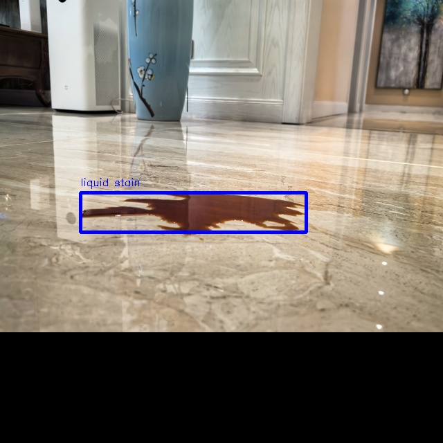

[English](./README.md) | 简体中文

Getting Started with Yolo World
=======


# 功能介绍

Yolo World package是基于 [Yolo-world](https://github.com/AILab-CVC/YOLO-World) 量化部署的使用示例。图像数据来源于本地图片回灌和订阅到的image msg。此外, Yolo World 支持根据输入文本变化改变检测类别, 此为yolo-world与常规yolo最大区别。文本可通过参数配置, 或运行中通过string msg 话题消息实时控制。文本特征来源来自本地特征库, 通过输入文本查询对应特征, 并输入到模型推理。最终在Yolo World的后处理中发布智能结果, 可通过web查看效果。

# 开发环境

- 编程语言: C/C++
- 开发平台: X5/X86
- 系统版本：Ubuntu 22.04
- 编译工具链: Linux GCC 11.4.0

# 编译

- X5版本：支持在X5 Ubuntu系统上编译和在PC上使用docker交叉编译两种方式。

- X86版本：支持在X86 Ubuntu系统上编译一种方式。

同时支持通过编译选项控制编译pkg的依赖和pkg的功能。

## 依赖库

- opencv:3.4.5

ros package：

- dnn node
- cv_bridge
- sensor_msgs
- hbm_img_msgs
- ai_msgs

hbm_img_msgs为自定义的图片消息格式, 用于shared mem场景下的图片传输, hbm_img_msgs pkg定义在hobot_msgs中, 因此如果使用shared mem进行图片传输, 需要依赖此pkg。


## 编译选项

1、SHARED_MEM

- shared mem（共享内存传输）使能开关, 默认打开（ON）, 编译时使用-DSHARED_MEM=OFF命令关闭。
- 如果打开, 编译和运行会依赖hbm_img_msgs pkg, 并且需要使用tros进行编译。
- 如果关闭, 编译和运行不依赖hbm_img_msgs pkg, 支持使用原生ros和tros进行编译。
- 对于shared mem通信方式, 当前只支持订阅nv12格式图片。

## X5 Ubuntu系统上编译

1、编译环境确认

- 板端已安装X5 Ubuntu系统。
- 当前编译终端已设置TogetherROS环境变量：`source PATH/setup.bash`。其中PATH为TogetherROS的安装路径。
- 已安装ROS2编译工具colcon。安装的ROS不包含编译工具colcon, 需要手动安装colcon。colcon安装命令：`pip install -U colcon-common-extensions`
- 已编译dnn node package

2、编译

- 编译命令：`colcon build --packages-select hobot_yolo_world`

## docker交叉编译 X5版本

1、编译环境确认

- 在docker中编译, 并且docker中已经安装好TogetherROS。docker安装、交叉编译说明、TogetherROS编译和部署说明详见机器人开发平台robot_dev_config repo中的README.md。
- 已编译dnn node package
- 已编译hbm_img_msgs package（编译方法见Dependency部分）

2、编译

- 编译命令：

  ```shell
  # RDK X5
  bash robot_dev_config/build.sh -p X5 -s hobot_yolo_world
  ```

- 编译选项中默认打开了shared mem通信方式。


## X86 Ubuntu系统上编译 X86版本

1、编译环境确认

  x86 ubuntu版本: ubuntu22.04
  
2、编译

- 编译命令：

  ```shell
  colcon build --packages-select hobot_yolo_world \
     --merge-install \
     --cmake-force-configure \
     --cmake-args \
     --no-warn-unused-cli \
     -DPLATFORM_X86=ON \
     -DTHIRD_PARTY=`pwd`/../sysroot_docker
  ```

## 注意事项


# 使用介绍

## 依赖

- mipi_cam package：发布图片msg
- usb_cam package：发布图片msg
- websocket package：渲染图片和ai感知msg

## 参数

| 参数名             | 解释                                  | 是否必须             | 默认值              | 备注                                                                    |
| ------------------ | ------------------------------------- | -------------------- | ------------------- | ----------------------------------------------------------------------- |
| feed_type          | 图片来源, 0：本地；1：订阅            | 否                   | 0                   |                                                                         |
| image              | 本地图片地址                          | 否                   | config/00131.jpg     |                                                                         |
| is_shared_mem_sub  | 使用shared mem通信方式订阅图片        | 否                   | 0                   |                                                                         |
| score_threshold | 模型输出置信度阈值 | 否 | 0.05 | |
| iou_threshold | nms iou阈值 | 否 | 0.45 | |
| nms_top_k | 检测前k个框 | 否 | 50 | |
| texts | 检测类型 | 否 | "liquid stain,mild stain,solid stain,congee stain" | 每个类别中间通过逗号隔开 |
| dump_render_img    | 是否进行渲染，0：否；1：是            | 否                   | 0                   |                                                                         |
| ai_msg_pub_topic_name | 发布智能结果的topicname,用于web端展示 | 否                   | /hobot_yolo_world | |
| ros_img_sub_topic_name | 接收ros图片话题名 | 否                   | /image | |
| ros_string_sub_topic_name | 接收string消息话题名改变检测类别 | 否                   | /target_words | |


## 使用说明

- 控制话题：hobot_yolo_world 支持通过string msg话题消息控制检测类别, 此为yolo-world与常规yolo主要区别。string msg话题使用示例如下。其中 /target_words 为话题名。data字段中的数据为string字符串, 设置多种检测类别时, 通过逗号隔开。

```
ros2 topic pub /target_words std_msgs/msg/String "{data: 'liquid stain,mild stain,solid stain,congee stain'}"
```

## 运行

- hobot_yolo_world 使用到的模型在安装包'config'路径下。

- 编译成功后, 将生成的install路径拷贝到地平线RDK上（如果是在RDK上编译, 忽略拷贝步骤）, 并执行如下命令运行。

## X5 Ubuntu系统上运行

运行方式1, 使用可执行文件启动：
```shell
export COLCON_CURRENT_PREFIX=./install
source ./install/local_setup.bash
# config中为示例使用的模型, 回灌使用的本地图片
# 根据实际安装路径进行拷贝（docker中的安装路径为install/lib/hobot_yolo_world/config/, 拷贝命令为cp -r install/lib/hobot_yolo_world/config/ .）。
cp -r install/hobot_yolo_world/lib/hobot_yolo_world/config/ .

# 运行模式1：
# 使用本地jpg格式图片进行回灌预测, 输入自定义类别
ros2 run hobot_yolo_world hobot_yolo_world --ros-args -p feed_type:=0 -p image:=config/00131.jpg -p image_type:=0 -p texts:="liquid stain,mild stain,solid stain,congee stain" -p dump_render_img:=1

# 运行模式2：
# 使用订阅到的image msg(topic为/image)进行预测, 设置受控话题名(/target_words)为并设置log级别为warn。同时在另一个窗口发送string话题(topic为/target_words) 变更检测类别
ros2 run hobot_yolo_world hobot_yolo_world --ros-args -p feed_type:=1 --ros-args --log-level warn -p ros_string_sub_topic_name:="/target_words"

ros2 topic pub /target_words std_msgs/msg/String "{data: 'liquid stain,mild stain,solid stain,congee stain'}"

# 运行模式3：使用shared mem通信方式(topic为/hbmem_img)进行预测, 并设置log级别为warn, 输入自定义类别。
ros2 run hobot_yolo_world hobot_yolo_world --ros-args -p feed_type:=1 -p is_shared_mem_sub:=1 -p texts:="liquid stain,mild stain,solid stain,congee stain" --ros-args --log-level warn

```

运行方式2, 使用launch文件启动：
```shell
export COLCON_CURRENT_PREFIX=./install
source ./install/setup.bash
# config中为示例使用的模型, 根据实际安装路径进行拷贝
# 如果是板端编译（无--merge-install编译选项）, 拷贝命令为cp -r install/PKG_NAME/lib/PKG_NAME/config/ ., 其中PKG_NAME为具体的package名。
cp -r install/lib/hobot_yolo_world/config/ .

# 配置MIPI摄像头
export CAM_TYPE=mipi

# 启动launch文件, 使用F37 sensor通过shared mem方式发布nv12格式图片
ros2 launch hobot_yolo_world yolo_world.launch.py
```

## X5 yocto系统上运行

```shell
export ROS_LOG_DIR=/userdata/
export LD_LIBRARY_PATH=${LD_LIBRARY_PATH}:./install/lib/

# config中为示例使用的模型, 回灌使用的本地图片
cp -r install/lib/hobot_yolo_world/config/ .

# 运行模式1：
# 使用本地jpg格式图片进行回灌预测, 输入自定义类别
./install/lib/hobot_yolo_world/hobot_yolo_world --ros-args -p feed_type:=0 -p image:=config/00131.jpg -p image_type:=0 -p texts:="liquid stain,mild stain,solid stain,congee stain" -p dump_render_img:=1

# 运行模式2：
# 使用订阅到的image msg(topic为/image)进行预测, 设置受控话题名(/target_words)为并设置log级别为warn。同时在另一个窗口发送string话题(topic为/target_words) 变更检测类别
./install/lib/hobot_yolo_world/hobot_yolo_world --ros-args -p feed_type:=1 --ros-args --log-level warn -p ros_string_sub_topic_name:="/target_words"

ros2 topic pub /target_words std_msgs/msg/String "{data: 'liquid stain,mild stain,solid stain,congee stain'}"

# 运行模式3：使用shared mem通信方式(topic为/hbmem_img)通过异步模式进行预测, 并设置log级别为warn
./install/lib/hobot_yolo_world/hobot_yolo_world --ros-args -p feed_type:=1 -p is_shared_mem_sub:=1 -p texts:="liquid stain,mild stain,solid stain,congee stain" --ros-args --log-level warn

```

## X86 Ubuntu系统上运行

```shell
export COLCON_CURRENT_PREFIX=./install
source ./install/setup.bash
# config中为示例使用的模型, 根据实际安装路径进行拷贝
cp -r ./install/lib/hobot_yolo_world/config/ .

# 启动launch文件, 
ros2 launch hobot_yolo_world yolo_world.launch.py
```

# 结果分析

## X5结果展示

log：

运行命令：`ros2 run hobot_yolo_world hobot_yolo_world --ros-args -p feed_type:=0 -p image:=config/00131.jpg -p image_type:=0 -p texts:="liquid stain,mild stain,solid stain,congee stain"`

```shell
[WARN] [0000073539.858080941] [hobot_yolo_world]: This is hobot yolo world!
[WARN] [0000073539.928492066] [hobot_yolo_world]: Parameter:
 feed_type(0:local, 1:sub): 0
 image: config/00131.jpg
 dump_render_img: 0
 is_shared_mem_sub: 0
 score_threshold: 0.05
 iou_threshold: 0.45
 nms_top_k: 50
 texts: liquid stain,mild stain,solid stain,congee stain
 ai_msg_pub_topic_name: /hobot_yolo_world
 ros_img_sub_topic_name: /image
 ros_string_sub_topic_name: /target_words
[WARN] [0000073539.934220983] [hobot_yolo_world]: Parameter:
 model_file_name: config/yolo_world.bin
 model_name:
[INFO] [0000073539.934344983] [dnn]: Node init.
[INFO] [0000073539.934384149] [hobot_yolo_world]: Set node para.
[WARN] [0000073539.934426691] [hobot_yolo_world]: model_file_name_: config/yolo_world.bin, task_num: 4
[INFO] [0000073539.934479483] [dnn]: Model init.
[BPU_PLAT]BPU Platform Version(1.3.6)!
[HBRT] set log level as 0. version = 3.15.52.0
[DNN] Runtime version = 1.23.9_(3.15.52 HBRT)
[A][DNN][packed_model.cpp:247][Model](1970-01-01,20:25:40.512.332) [HorizonRT] The model builder version = 1.23.5
[W][DNN]bpu_model_info.cpp:491][Version](1970-01-01,20:25:40.722.986) Model: yolo_world_epoch_40_no_pad_offline_vocab_static_norm_new. Inconsistency between the hbrt library version 3.15.52.0 and the model build version 3.15.47.0 detected, in order to ensure correct model results, it is recommended to use compilation tools and the BPU SDK from the same OpenExplorer package.
[INFO] [0000073540.731020608] [dnn]: The model input 0 width is 3 and height is 640
[INFO] [0000073540.731121941] [dnn]: The model input 1 width is 1 and height is 512
[INFO] [0000073540.731290525] [dnn]:
Model Info:
name: yolo_world_epoch_40_no_pad_offline_vocab_static_norm_new.
[input]
 - (0) Layout: NHWC, Shape: [1, 640, 640, 3], Type: HB_DNN_TENSOR_TYPE_F32.
 - (1) Layout: NHWC, Shape: [1, 4, 512, 1], Type: HB_DNN_TENSOR_TYPE_F32.
[output]
 - (0) Layout: NCHW, Shape: [1, 8400, 4, 1], Type: HB_DNN_TENSOR_TYPE_F32.
 - (1) Layout: NCHW, Shape: [1, 8400, 4, 1], Type: HB_DNN_TENSOR_TYPE_F32.

[INFO] [0000073540.731377233] [dnn]: Task init.
[INFO] [0000073540.733611483] [dnn]: Set task_num [4]
[WARN] [0000073540.733678275] [hobot_yolo_world]: Get model name: yolo_world_epoch_40_no_pad_offline_vocab_static_norm_new from load model.
[INFO] [0000073540.733720691] [hobot_yolo_world]: The model input width is 640 and height is 640
[WARN] [0000073540.733783483] [hobot_yolo_world]: Create ai msg publisher with topic_name: /hobot_yolo_world
[INFO] [0000073540.758860233] [hobot_yolo_world]: Dnn node feed with local image: config/00131.jpg
[INFO] [0000073540.954308816] [hobot_yolo_world]: Output from frame_id: feedback, stamp: 0.0
[INFO] [0000073540.955560941] [hobot_yolo_world]: out box size: 1
[INFO] [0000073540.955676525] [hobot_yolo_world]: det rect: 116.345 278.612 442.626 336.136, det type: liquid stain, score:0.855555
```

## 渲染结果


说明：前处理对图片进行缩放和补全处理。